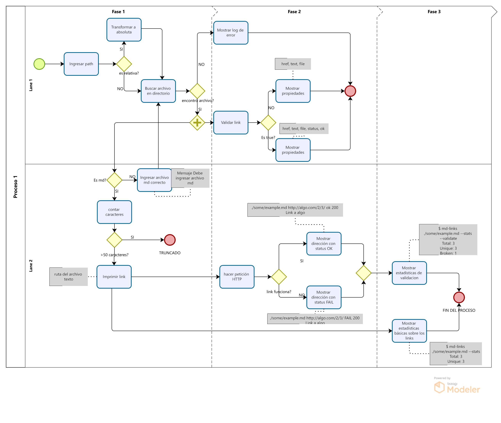

# Markdown Links

## Índice

* [1. Resumen del proyecto](#1-resumen-del-proyecto)
* [2. Consideraciones generales](#2-consideraciones-generales)
* [3. Modo de uso](#4-modo-de-uso)
* [4. Diagrama de flujo](#5-diagrama-de-flujo)

***


## 1. Resumen del proyecto

Herramienta creada con [Node.js](https://nodejs.org/), que lee y analiza archivos
en formato `Markdown`, para verificar los links que contengan y reportar
algunas estadísticas.

## 2. Consideraciones generales

* La **librería** y el **script ejecutable** (herramienta de línea de comando -
  CLI) estan implementados en JavaScript y son ejecutados con Node.js.
  
 * Se uso [chalk](https://www.npmjs.com/package/chalk) para personalizar
 el estilo de la aplicación en la terminal.

* Para este proyecto se uso ES Modules `(import/export)`, en lugar de commonJS `(require/module.exports)`.

## 3. Modo de uso 
### JavaScript API

#### `mdLinks(path, options)`

##### Argumentos

* `path`: Ruta **absoluta** o **relativa** al **archivo** o **directorio**.
Si la ruta pasada es relativa, debe resolverse como relativa al directorio
desde donde se invoca node - _current working directory_).
* `options`: Un objeto con **únicamente** la siguiente propiedad:
  - `validate`: Booleano que determina si se desea validar los links
    encontrados.

### CLI (Command Line Interface - Interfaz de Línea de Comando)

El ejecutable de la aplicación es de la siguiente
manera a través de la **terminal**:

`md-links <path-to-file> [options]`

Por ejemplo:

```sh
$ md-links ./some/example.md
./some/example.md http://algo.com/2/3/ Link a algo
./some/example.md https://otra-cosa.net/algun-doc.html algún doc
./some/example.md http://google.com/ Google
```

El comportamiento por defecto no debe validar si las URLs responden ok o no,
solo debe identificar el archivo markdown (a partir de la ruta que recibe como
argumento), analizar el archivo Markdown e imprimir los links que vaya
encontrando, junto con la ruta del archivo donde aparece y el texto
que hay dentro del link (truncado a 50 caracteres).

#### Options

##### `--help`

Si pasamos la opción `--help` la salida sera un mensaje que explique el uso y las opciones a disposición para le uso de la herramienta. Dara instrucciones de como usar la herramienta. 

Por ejemplo:

```sh
$ mdLinks './test/ejemplo.md' --help
 option: 
--validate   Muestra el estatus de cada link.
--stats      Muestra las estadisticas de cada link.
--help       Muestra las instrucciones de uso de la herramienta.
```

##### `--validate`

Si pasamos la opción `--validate`, el módulo hace una petición HTTP para
averiguar si el link funciona o no. Si el link resulta en una redirección a una
URL que responde ok, entonces consideraremos el link como ok.

Por ejemplo:

```sh
$ md-links ./some/example.md --validate
./some/example.md http://algo.com/2/3/ ok 200 Link a algo
./some/example.md https://otra-cosa.net/algun-doc.html fail 404 algún doc
./some/example.md http://google.com/ ok 301 Google
```

Vemos que el _output_ en este caso incluye la palabra `ok` o `fail` después de
la URL, así como el status de la respuesta recibida a la petición HTTP a dicha
URL.

##### `--stats`

Si pasamos la opción `--stats` el output (salida) será un texto con estadísticas
básicas sobre los links.

```sh
$ md-links ./some/example.md --stats
Total: 3
Unicos: 3
```

También podemos combinar `--stats` y `--validate` para obtener estadísticas que
necesiten de los resultados de la validación.

```sh
$ md-links ./some/example.md --stats --validate
Total: 3
Unicos: 3
Broken: 1
```

## 4. Diagrama de flujo


